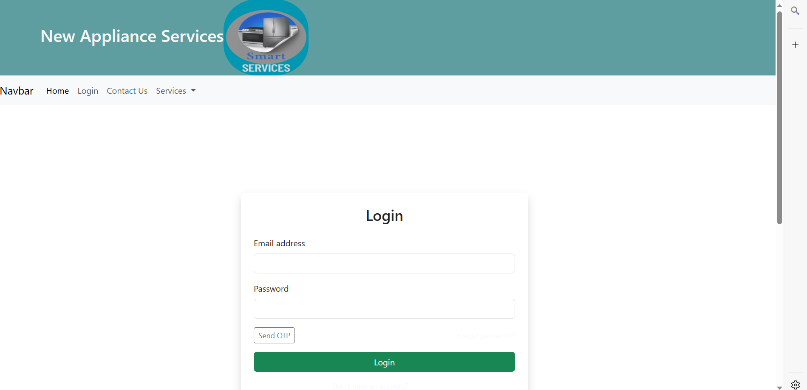
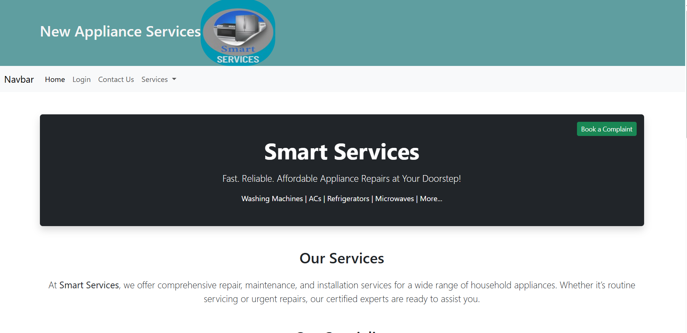

# ApplianceService
ApplianceService
# 🛠️ Appliance Service Management System

The **Appliance Service Management System** is a Django-based web application designed to streamline the process of managing customer service requests for home appliances. The system allows customers to raise complaints, and helps the admin assign technicians to resolve issues efficiently.

---

## 🚀 Features

### 👤 Customer Features
- Register and login securely.
- Submit service complaints by selecting an appliance and describing the issue.
- View complaint status updates.

### 🛠️ Technician/Admin Features
- Admin dashboard to manage complaints and assign technicians.
- Track the status of service requests: **Pending → Assigned → In Progress → Completed**.
- Dynamic complaint form with support for multiple issues per request.

---

## 🧱 Tech Stack

- **Backend:** Django (Python)
- **Frontend:** HTML, CSS, Bootstrap, JavaScript
- **Database:** SQLite
- **Others:** Django Admin, Django Messages Framework, Bootstrap Progress Bars

---

## 📸 Screenshots

| Login Page | Signup Form | 
|------------|----------------|
|  |  | 

---

## ⚙️ Installation Instructions

1. **Clone the Repository**
   ```bash
   git clone https://github.com/soumyams1219/appliance-service.git
   cd appliance-service

